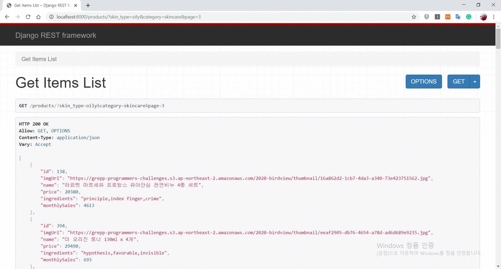
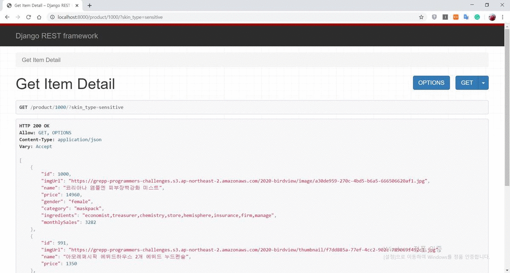

# Django Server API Challenge
Used Tech : <b>Python, Django, Django rest framework</b>  
View Type : FBV (Function Based View)  
Chanllenge URL : https://programmers.co.kr/competitions/130/2020-hwahae-blind-recruitment  

# Server API Play video
[Server API](django-server-api.mp4)

# Description
<상품 목록 조회하기>  
         피부 타입 별로 추가적인 옵션에 따라 필터링해 상품 목록을 조회할 수 있어야 하며, 상품 목록은 페이지당 50개로 제한한다.  
         필수 : skin_type(피부 타입)에 대한 성분 점수가 높은 순으로 보여준다. 만약, 동점이라면 price(가격)이 낮은 순으로 보인다.  
         옵션 : category(화장품 종류), include_ingredient(포함된 성분), exclude_ingredient(제외할 성분), page(페이지)  
         <pre>
         Query String Example :
         http://mywepsite/products/?skin_type=oily&category=skincare&page=3&include_ingredient=waterfall
         </pre>
         

<상품 상세보기>  
         상품 목록에서 상품 하나를 클릭하면, 상세보기로 전환되며 섬네일 이미지에서 전체 이미지로 바꿔 출력하고,  
         선택한 상품과 같은 피부 타입의 상품 3가지를 보인다.  
         <pre>
         Query String Example :
         http://mywepsite/product/1000/?skin_type=sensitive
         </pre>
         
